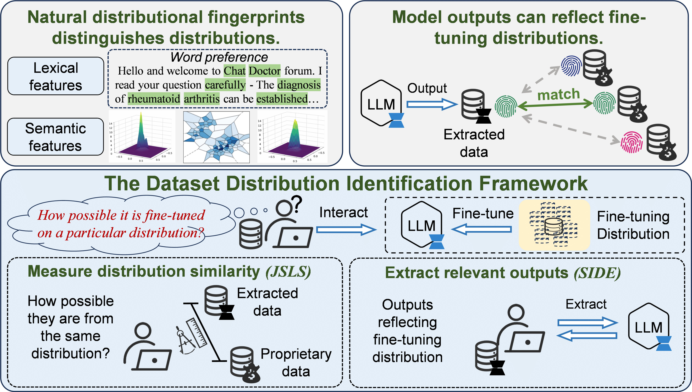

# Dataset Distribution Identification

This is the official code repository for paper **Dataset Distribution Identification: Private Data Provenance in Fine-tuned LLMs via Natural Distributional Fingerprint**. 

In this paper, we propose Dataset Distribution Identification (DDI), a novel framework that enhances data management through unauthorized data usage detection and data privacy leakage assessment. Given the high value of proprietary LLM fine-tuning data and potential infringement risks, DDI plays a critical role in data curation and security for the LLM era, focusing on data provenance and infringement detection while complementing prior works with greater effectiveness and robustness. In particular, Section 5 details DDI's applications to fine-tuning data provenance and data privacy assessments, and Section 6 evaluates DDI's effectiveness, robustness, and reliability for LLM data management.

The paper is now under review of ICDE'26 Round-2. More organized codes will be released after the paper is accepted.



## Environment Setup

### 1. Create Conda Environment

To replicate the environment, follow these steps:

#### Step 1: Create a new conda environment and activate it

```sh
> conda create -n DDI python=3.10.16 -y

> conda activate DDI
```

#### 2. Install Dependencies

```
> pip install -r requirements.txt
```

In particular, our experiments are carried out on an A100 GPU with ` CUDA Version: 12.4` and `torch==2.7.0`. You may need to specifically install `torch` according to your devices. 

## 2. Install Datasets and Models

DDI can be applied to any datasets and base models. For reproducing the experiments mentioned in the original paper, we detail the datasets and models used in our experiments.

### Datasets:

- MedAlpaca: [wikidoc](https://huggingface.co/datasets/medalpaca/medical_meadow_wikidoc), [flashcards](https://huggingface.co/datasets/medalpaca/medical_meadow_medical_flashcards)
- ChatDoctor: [HCM](https://huggingface.co/datasets/xDAN-datasets/ChatDoctor_HealthCareMagic_112k), [GPT](https://huggingface.co/datasets/xDAN-datasets/ChatDoctor_chatdoctor_7k)
- CaseLaw: [Del](https://huggingface.co/datasets/free-law/Caselaw_Access_Project/tree/main/delaware), [Ariz](https://huggingface.co/datasets/free-law/Caselaw_Access_Project/tree/main/arizona)

We will provide the processed datasets in this repo.

### Models:

[Pythia-2.8b](https://huggingface.co/EleutherAI/pythia-2.8b), [Qwen3-4B-Instruct](https://huggingface.co/Qwen/Qwen3-4B-Instruct-2507), [Llama3-8B-Instruct](https://huggingface.co/unsloth/Meta-Llama-3.1-8B-Instruct-bnb-4bit)


## Evaluation Details

### Fine-tuning models

```py
# For the Q&A mode:
python ./fine-tuning/ft_qa.py
```

```py
# For the completion mode:
python ./fine-tuning/ft_complete.py
```

### Measure distributions via JSLS

```py
python ./DDI/jsls.py
```

### Extract outputs via SIDE

```py
# For the Q&A mode:
python ./DDI/side/side_qa.py
```

```py
# For the Q&A mode:
python ./DDI/side/side_complete.py
```

